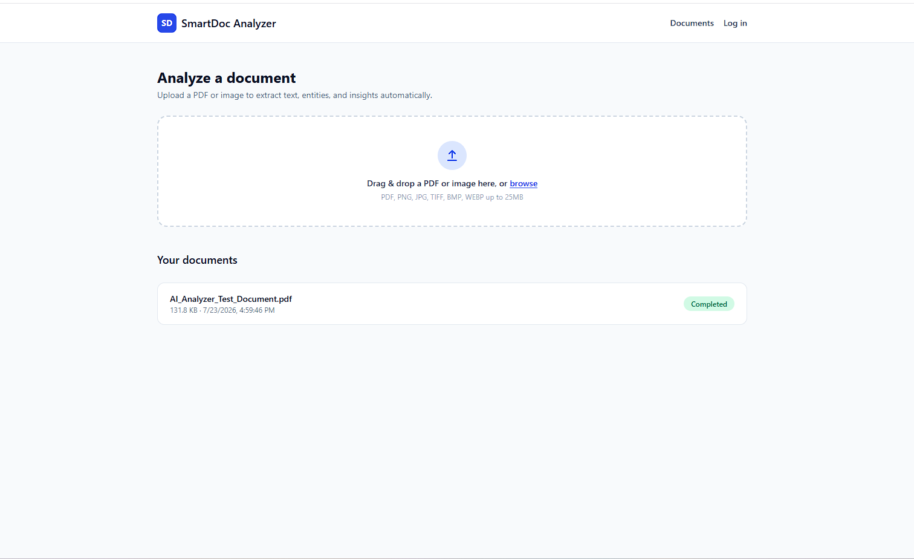
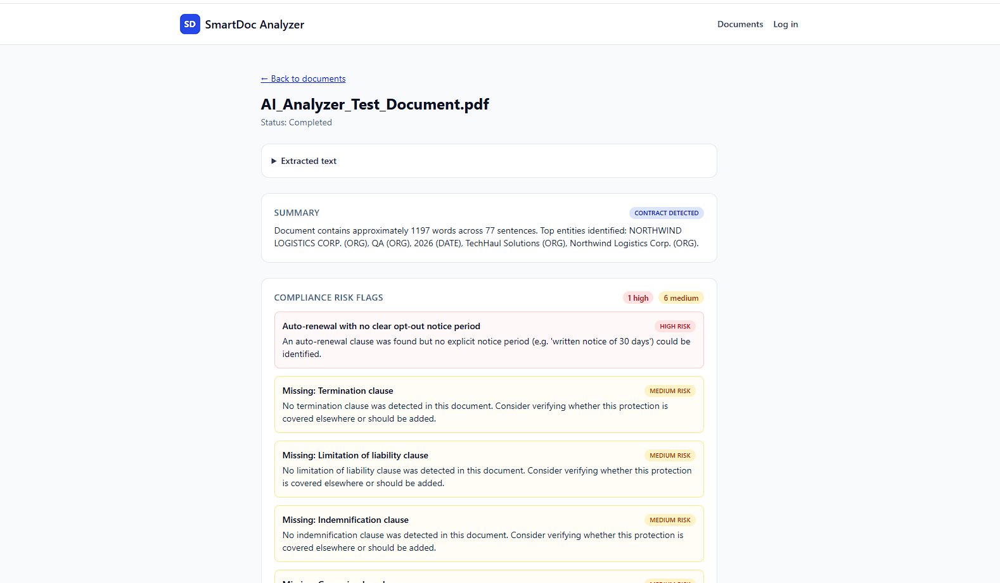
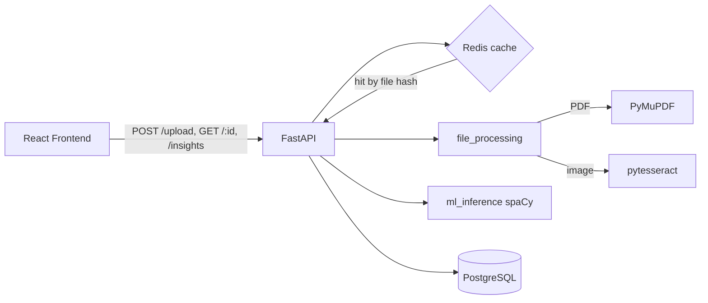

# SmartDoc Analyzer

Junior software-engineer portfolio project: **PDF/image → OCR/NLP insights + contract risk flags**.

Upload a PDF or image. The API extracts text (PyMuPDF or Tesseract), runs local spaCy for entities and document stats, and, when the text looks like a contract, adds rule-based risk flags. PostgreSQL stores the document and insight; Redis caches by SHA-256 so an identical file skips repeat work.

**No external LLM.** Summaries and entities come from spaCy (`en_core_web_sm`) on the API host. After that model is installed, analysis runs offline.

## Status

**Demo:** local and Docker Compose only. There is no public live demo.

**NLP:** spaCy `en_core_web_sm`, fully offline. No calls to an external language model.

## Features

- Upload PDFs and images (`pdf`, `png`, `jpg`, `jpeg`, `tiff`, `bmp`, `webp`) and extract text.
- Named entities, keyword frequency, and a short statistical summary.
- Contract risk flags when the text looks like a contract (missing clauses, auto-renewal, payment terms, jurisdiction conflicts).
- Redis cache keyed by file hash so duplicate uploads reuse a prior result.
- Optional JWT. Anonymous uploads work; authenticated uploads are scoped to that user.

### Limitations

- Upload processing is synchronous. The request stays open until OCR and NLP finish.
- The default model is spaCy `en_core_web_sm` (small English). The summary is word and sentence counts plus top entities, not generated prose.
- Contract flags are keyword and regex rules. They are a review aid, not legal advice.

## Screenshots

Captures of the local UI. Analysis runs through Docker Compose only; there is no public live demo.

### Dashboard

The home page accepts a PDF or image and lists recent documents.



### Document detail

A completed document shows metadata, extracted text, named entities, and summary statistics.



## Architecture



**Flow:** upload → SHA-256 hash → Redis (skip reprocessing on a duplicate) → extract text → spaCy NER and insight generation → persist `Document` and `Insight` in Postgres → cache the result → return the document. The frontend polls while status is `processing` and renders entities and insights once `completed`.

### Compliance risk scanning

If the extracted text looks like a contract (`app/services/compliance.py::is_likely_contract`), the pipeline runs a rule-based risk scan and stores it on the `Insight` (`document_type: "contract"`, `risk_flags: [...]`). The goal is "what should I worry about?", not only word and entity counts:

- **Missing standard clauses** — termination, limitation of liability, indemnification, confidentiality, dispute resolution.
- **Auto-renewal risk** — flags auto-renewal language and checks whether the opt-out notice window is short (< 30 days) or unspecified.
- **Unusual payment terms** — flags `Net 60+` terms and 100%-upfront payment requirements.
- **Jurisdiction conflicts** — flags contracts that cite more than one governing-law jurisdiction.

Each flag has a `severity` (`high` / `medium` / `low`), a `title` and `description`, and optional `evidence` (a text snippet). The document detail page shows these in a risk panel, only for documents classified as contracts.

## Tech stack

| Layer | Technology |
|---|---|
| Frontend | React 18 + TypeScript + Vite + TailwindCSS + React Router |
| Backend | FastAPI + Pydantic v2 |
| Database | PostgreSQL (SQLAlchemy 2.0 + Alembic migrations) |
| Cache | Redis (keyed by file SHA-256 hash) |
| ML / NLP | spaCy (`en_core_web_sm`) for NER, keyword frequency, and statistical insight generation. No external LLM. |
| File processing | PyMuPDF (PDF text), pytesseract + Pillow (OCR for images) |
| Auth | Optional JWT (anonymous uploads work; authenticated uploads are scoped to the user) |
| Infra | Docker Compose (api, frontend, db, redis). Frontend can deploy to Vercel and the API to Railway; nothing is live right now. |

## Project structure

```
backend/
  app/
    core/        # config, database, security (JWT/password hashing)
    models/      # SQLAlchemy models: User, Document, Insight
    schemas/     # Pydantic request/response schemas
    routers/     # documents, auth, health (mounted under /api/v1)
    services/    # file_processing, ml_inference, compliance, cache
    deps.py      # optional/required auth dependencies
    main.py      # app factory, CORS, global error handlers
  alembic/       # DB migrations
  Dockerfile
  requirements.txt
frontend/
  src/
    components/  # Navbar, UploadDropzone, DocumentList, InsightsPanel, RiskFlagsPanel
    pages/       # DashboardPage, DocumentDetailPage, LoginPage
    context/     # AuthContext (JWT storage)
    lib/api.ts   # typed API client
  Dockerfile
  vercel.json
docker-compose.yml
.env.example
docs/screenshots/
```

## Prerequisites

- Docker and Docker Compose (recommended), **or**
- Python 3.11+, Node.js 20+, PostgreSQL 16, Redis 7, and `tesseract-ocr` installed locally.

## Quick start (Docker Compose)

```bash
# 1. Copy environment files
cp .env.example .env
cp backend/.env.example backend/.env
cp frontend/.env.example frontend/.env

# 2. Build and start everything
docker compose up --build

# 3. Open the app
# Frontend:  http://localhost:5173
# API docs:  http://localhost:8000/docs
# Health:    http://localhost:8000/api/v1/health
```

The `api` service runs `alembic upgrade head` on startup, so the schema is migrated before Uvicorn starts. Services define healthchecks, and `frontend` / `api` wait until their dependencies are healthy.

## Running without Docker

### Backend

```bash
cd backend
python -m venv .venv
source .venv/bin/activate      # Windows: .venv\Scripts\activate
pip install -r requirements.txt
python -m spacy download en_core_web_sm

# PostgreSQL and Redis must already be running, then:
cp .env.example .env           # edit DATABASE_URL / REDIS_URL if needed
alembic upgrade head
uvicorn app.main:app --reload --port 8000
```

pytesseract needs the `tesseract-ocr` binary on `PATH` (`apt-get install tesseract-ocr` on Debian/Ubuntu, or the Tesseract Windows installer).

### Frontend

```bash
cd frontend
npm install
cp .env.example .env           # set VITE_API_URL if not http://localhost:8000/api/v1
npm run dev
```

## Environment variables

### Backend (`backend/.env`)

| Variable | Description | Default |
|---|---|---|
| `DATABASE_URL` | PostgreSQL connection string | `postgresql://smartdoc:smartdoc@db:5432/smartdoc` |
| `REDIS_URL` | Redis connection string | `redis://redis:6379/0` |
| `JWT_SECRET` | Secret used to sign JWTs (set a strong value in production) | `change-me-in-production` |
| `JWT_ALGORITHM` | JWT signing algorithm | `HS256` |
| `JWT_EXPIRE_MINUTES` | Access token lifetime in minutes | `10080` (7 days) |
| `SPACY_MODEL` | spaCy model name to load | `en_core_web_sm` |
| `UPLOAD_DIR` | Directory where uploaded files are stored | `uploads` |
| `MAX_UPLOAD_SIZE_MB` | Max accepted upload size | `25` |
| `CACHE_TTL_SECONDS` | Redis cache TTL for processed results | `86400` |
| `CORS_ORIGINS` | Allowed origins (JSON array or comma-separated) | `["http://localhost:5173","http://localhost:3000"]` |
| `DEBUG` | Include exception details in 500 responses | `false` |

### Frontend (`frontend/.env`)

| Variable | Description | Default |
|---|---|---|
| `VITE_API_URL` | Base URL of the backend API | `http://localhost:8000/api/v1` |

### Root (`.env`, used by `docker-compose.yml`)

| Variable | Description |
|---|---|
| `POSTGRES_USER` / `POSTGRES_PASSWORD` / `POSTGRES_DB` | Postgres credentials for the `db` service |
| `VITE_API_URL` | Passed as a build arg to the `frontend` image |

## API reference

All endpoints are prefixed with `/api/v1`. Errors return `{"detail": "message"}` with an HTTP status (`400`, `401`, `404`, `409`, `413`, `422`, `500`).

| Method | Path | Auth | Description |
|---|---|---|---|
| `POST` | `/documents/upload` | Optional | Upload a PDF or image (`multipart/form-data`, field `file`). Processing is synchronous; the response already has the final `status`. |
| `GET` | `/documents` | Optional | List documents (current user if authenticated, otherwise anonymous documents). |
| `GET` | `/documents/{id}` | None | Document metadata and extracted text. |
| `GET` | `/documents/{id}/insights` | None | Entities, summary, and statistics for a completed document. `409` if still processing, `422` if processing failed. |
| `POST` | `/auth/register` | None | Create a user (`email`, `password`). |
| `POST` | `/auth/login` | None | Exchange credentials for a JWT (`access_token`). |
| `GET` | `/health` | None | API, database, and Redis status. Used by Docker and Railway health checks. |

Interactive docs: `/docs` (Swagger UI) and `/redoc` while the API is running.

## Deployment

These steps are for a future deploy. They are not a live demo.

### Frontend → Vercel

1. Import the repository and set the project root to `frontend/`.
2. Framework preset: Vite. Build command: `npm run build`. Output directory: `dist` (`frontend/vercel.json` also rewrites client-side routes to `index.html`).
3. Set `VITE_API_URL` to your deployed API base, including the `/api/v1` prefix.
4. Deploy.

### Backend → Railway

1. Create a Railway project from this repo, rooted at `backend/`. `backend/railway.json` sets the Dockerfile build and the `/api/v1/health` health check.
2. Add Railway PostgreSQL and Redis.
3. Set service variables:
   - `DATABASE_URL` — Postgres connection string from the plugin
   - `REDIS_URL` — Redis connection string
   - `JWT_SECRET` — a strong random secret
   - `SPACY_MODEL` — `en_core_web_sm`
   - `CORS_ORIGINS` — JSON array that includes your frontend origin
4. Deploy. The container runs `alembic upgrade head` before Uvicorn.

### Docker on a VPS

`docker compose up --build -d` works on a VPS with Docker. Fill in `.env` and `backend/.env`, and put a TLS reverse proxy (Caddy or Nginx) in front of `frontend` (port 80 in the container, published as 5173) and `api` (port 8000).

## Notes

- Duplicate uploads (same file bytes) skip re-extraction and re-inference by reusing the Redis result, keyed by SHA-256.
- Max upload size and allowed extensions are enforced in `app/services/file_processing.py`.

## License

[MIT](LICENSE).
