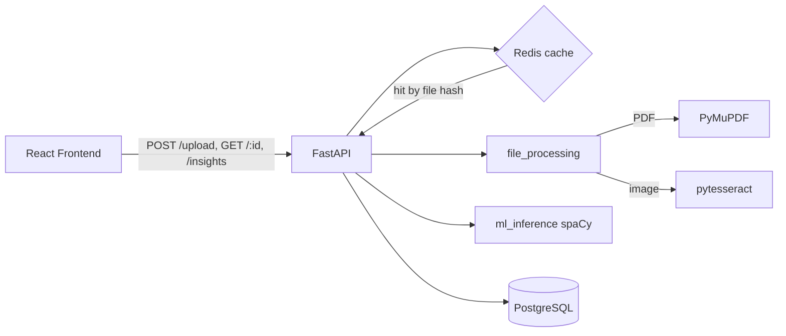

# SmartDoc Analyzer

A full-stack AI document analysis system. Users upload PDFs or images; the backend extracts text (PyMuPDF / pytesseract), runs NLP entity extraction and insight generation (spaCy), stores documents and results in PostgreSQL, and caches processed outputs in Redis to skip duplicate work.

## Architecture



**Flow:** upload -> compute SHA-256 hash -> check Redis (skip reprocessing on duplicate) -> extract text -> spaCy NER + insight generation -> persist `Document` + `Insight` in Postgres -> cache result -> return document record. The frontend polls the document while it's `processing` and renders entities/insights once `completed`.

### Compliance risk scanning

If the extracted text looks like a contract (`app/services/compliance.py::is_likely_contract`), the pipeline additionally runs a rule-based risk scan and stores the result on the `Insight` (`document_type: "contract"`, `risk_flags: [...]`). This answers "what should I worry about?" rather than just reporting word/entity frequencies:

- **Missing standard clauses** — termination, limitation of liability, indemnification, confidentiality, dispute resolution.
- **Auto-renewal risk** — flags auto-renewal language and checks whether the opt-out notice window is short (< 30 days) or unspecified.
- **Unusual payment terms** — flags `Net 60+` terms and 100%-upfront payment requirements.
- **Jurisdiction conflicts** — flags contracts that cite more than one governing-law jurisdiction.

Each flag has a `severity` (`high`/`medium`/`low`), a human-readable `title`/`description`, and optional `evidence` (a text snippet). The frontend renders these in a dedicated risk panel on the document detail page, only for documents classified as contracts.

## Tech stack

| Layer      | Technology |
|------------|------------|
| Frontend   | React 18 + TypeScript + Vite + TailwindCSS + React Router |
| Backend    | FastAPI + Pydantic v2 |
| Database   | PostgreSQL (SQLAlchemy 2.0 + Alembic migrations) |
| Cache      | Redis (keyed by file SHA-256 hash) |
| ML / NLP   | spaCy (`en_core_web_sm`) for NER, keyword frequency, and statistical insight generation |
| File processing | PyMuPDF (PDF text extraction), pytesseract + Pillow (OCR for images) |
| Auth       | Optional JWT (uploads work anonymously; authenticated uploads are scoped to the user) |
| Infra      | Docker Compose (api, frontend, db, redis); deploy frontend to Vercel, backend to Railway |

## Project structure

```
backend/
  app/
    core/        # config, database, security (JWT/password hashing)
    models/      # SQLAlchemy models: User, Document, Insight
    schemas/     # Pydantic request/response schemas
    routers/     # documents, auth, health (mounted under /api/v1)
    services/    # file_processing, ml_inference, cache
    deps.py      # optional/required auth dependencies
    main.py      # app factory, CORS, global error handlers
  alembic/       # DB migrations
  Dockerfile
  requirements.txt
frontend/
  src/
    components/  # Navbar, UploadDropzone, DocumentList, InsightsPanel
    pages/       # DashboardPage, DocumentDetailPage, LoginPage
    context/     # AuthContext (JWT storage)
    lib/api.ts   # typed API client
  Dockerfile
  vercel.json
docker-compose.yml
.env.example
```

## Prerequisites

- Docker & Docker Compose (recommended path), **or**
- Python 3.11+, Node.js 20+, PostgreSQL 16, Redis 7, and `tesseract-ocr` installed locally.

## Quick start (Docker Compose)

```bash
# 1. Copy environment files
cp .env.example .env
cp backend/.env.example backend/.env
cp frontend/.env.example frontend/.env

# 2. Build and start everything
docker compose up --build

# 3. Open the app
# Frontend:  http://localhost:5173
# API docs:  http://localhost:8000/docs
# Health:    http://localhost:8000/api/v1/health
```

The `api` service runs `alembic upgrade head` automatically on startup, so the database schema is created/migrated before Uvicorn starts. All services define `healthcheck`s, and `frontend`/`api` wait for their dependencies to become healthy.

## Running without Docker

### Backend

```bash
cd backend
python -m venv .venv
.venv\Scripts\activate        # Windows
pip install -r requirements.txt
python -m spacy download en_core_web_sm

# Ensure PostgreSQL and Redis are running locally, then:
cp .env.example .env           # edit DATABASE_URL / REDIS_URL if needed
alembic upgrade head
uvicorn app.main:app --reload --port 8000
```

Note: pytesseract requires the `tesseract-ocr` binary to be installed and on your `PATH` (e.g. via the Tesseract Windows installer, or `apt-get install tesseract-ocr` on Linux).

### Frontend

```bash
cd frontend
npm install
cp .env.example .env           # set VITE_API_URL if not http://localhost:8000/api/v1
npm run dev
```

## Environment variables

### Backend (`backend/.env`)

| Variable | Description | Default |
|---|---|---|
| `DATABASE_URL` | PostgreSQL connection string | `postgresql://smartdoc:smartdoc@db:5432/smartdoc` |
| `REDIS_URL` | Redis connection string | `redis://redis:6379/0` |
| `JWT_SECRET` | Secret used to sign JWTs (set a strong value in production) | `change-me-in-production` |
| `JWT_ALGORITHM` | JWT signing algorithm | `HS256` |
| `JWT_EXPIRE_MINUTES` | Access token lifetime in minutes | `10080` (7 days) |
| `SPACY_MODEL` | spaCy model name to load | `en_core_web_sm` |
| `UPLOAD_DIR` | Directory where uploaded files are stored | `uploads` |
| `MAX_UPLOAD_SIZE_MB` | Max accepted upload size | `25` |
| `CACHE_TTL_SECONDS` | Redis cache TTL for processed results | `86400` |
| `CORS_ORIGINS` | JSON array of allowed origins | `["http://localhost:5173","http://localhost:3000"]` |
| `DEBUG` | Include exception details in 500 responses | `false` |

### Frontend (`frontend/.env`)

| Variable | Description | Default |
|---|---|---|
| `VITE_API_URL` | Base URL of the backend API | `http://localhost:8000/api/v1` |

### Root (`.env`, used by `docker-compose.yml`)

| Variable | Description |
|---|---|
| `POSTGRES_USER` / `POSTGRES_PASSWORD` / `POSTGRES_DB` | Postgres credentials for the `db` service |
| `VITE_API_URL` | Passed as a build arg to the `frontend` image |

## API reference

All endpoints are prefixed with `/api/v1`. Errors always return `{"detail": "message"}` with an appropriate HTTP status code (`400`, `401`, `404`, `409`, `413`, `422`, `500`).

| Method | Path | Auth | Description |
|---|---|---|---|
| `POST` | `/documents/upload` | Optional | Upload a PDF/image (`multipart/form-data`, field `file`). Returns the created document record; processing happens synchronously and the response reflects the final `status`. |
| `GET` | `/documents` | Optional | List documents (scoped to the current user if authenticated, otherwise anonymous documents). |
| `GET` | `/documents/{id}` | None | Get document metadata and extracted text. |
| `GET` | `/documents/{id}/insights` | None | Get entities, summary, and statistics for a completed document. `409` if still processing, `422` if processing failed. |
| `POST` | `/auth/register` | None | Create a user account (`email`, `password`). |
| `POST` | `/auth/login` | None | Exchange credentials for a JWT (`access_token`). |
| `GET` | `/health` | None | Reports API, database, and Redis status; used by Docker/Railway health checks. |

Interactive docs are available at `/docs` (Swagger UI) and `/redoc` while the API is running.

## Deployment

### Frontend -> Vercel

1. Import the repository into Vercel and set the project root to `frontend/`.
2. Framework preset: Vite. Build command: `npm run build`. Output directory: `dist` (already configured in `frontend/vercel.json`, which also adds an SPA rewrite so client-side routes work on refresh).
3. Set the environment variable `VITE_API_URL` to your deployed Railway API URL (e.g. `https://smartdoc-api.up.railway.app/api/v1`).
4. Deploy.

### Backend -> Railway

1. Create a new Railway project and add a service from this repo, pointing to the `backend/` directory (the included `backend/railway.json` configures the Dockerfile build and `/api/v1/health` health check).
2. Add Railway's **PostgreSQL** and **Redis** plugins to the project.
3. Set service environment variables:
   - `DATABASE_URL` -> Railway Postgres connection string (from the plugin's variable reference)
   - `REDIS_URL` -> Railway Redis connection string
   - `JWT_SECRET` -> a strong random secret
   - `SPACY_MODEL` -> `en_core_web_sm`
   - `CORS_ORIGINS` -> JSON array including your Vercel frontend URL, e.g. `["https://smartdoc-analyzer.vercel.app"]`
4. Deploy. The container runs `alembic upgrade head` before starting Uvicorn, so migrations apply automatically on every deploy.

### Alternative: Docker on a VPS

`docker compose up --build -d` works as-is on any VPS with Docker installed; just populate `.env`, `backend/.env`, and put a reverse proxy (e.g. Caddy/Nginx) with TLS in front of the `frontend` (port 80) and `api` (port 8000) services.

## Notes

- Insight generation is deterministic/statistical over spaCy's output (entity frequency, entity-type breakdown, top keywords, word/sentence counts) — no external LLM calls are made, so it runs fully offline.
- Duplicate uploads (same file content) skip re-extraction and re-inference by reusing the cached Redis result, keyed by the file's SHA-256 hash.
- Max upload size and allowed file extensions are enforced server-side in `app/services/file_processing.py`.
